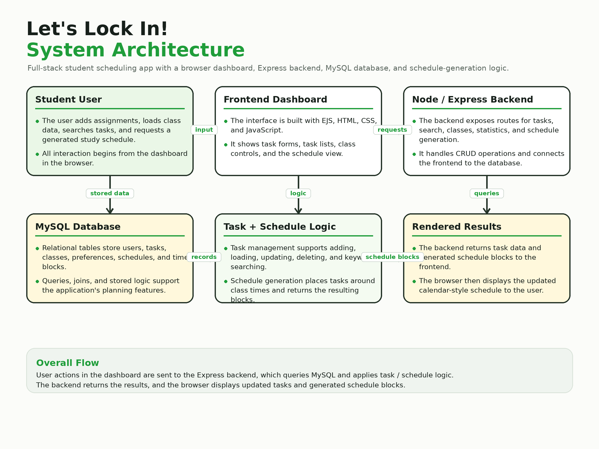
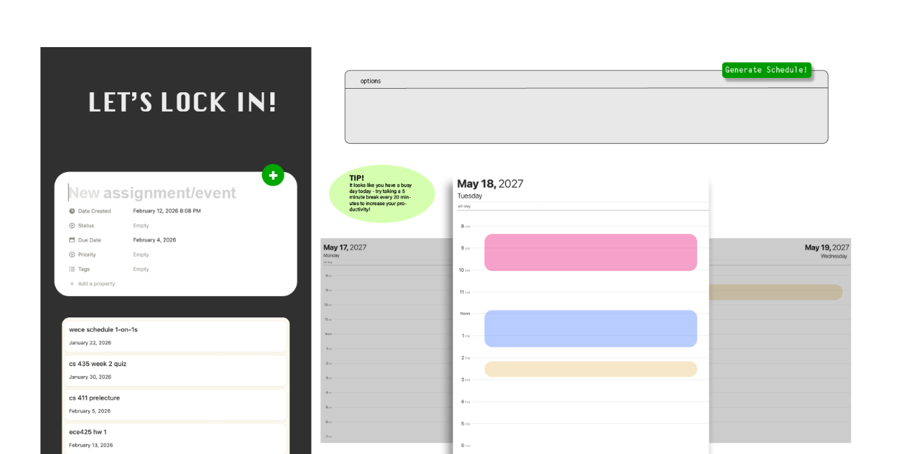

# Let's Lock In

A full-stack scheduling and productivity web app designed to help students manage assignments, events, classes, and daily study blocks in one place.

## Overview

Let's Lock In is a student productivity application that helps users organize tasks and generate a structured daily schedule. Users can add assignments or events, search tasks by keyword, load class information, and generate a schedule that places tasks around class blocks.

The project was built for CS 411 Database Systems and focuses on connecting a frontend interface, Node/Express backend, and MySQL database with relational schema design, stored procedures, triggers, and CRUD/query functionality.

## My Role

I focused mainly on the frontend and integration side of the project. My contributions included designing and implementing UI functionality, connecting frontend actions to backend API routes, implementing keyword search functionality, supporting interactive schedule visualization, and helping structure/populate class data for the database.

## Project Gallery

### System Architecture

<p align="center">
  
</p>

The dashboard communicates with a Node/Express backend through REST-style API endpoints. The backend queries a MySQL database, calls stored procedures for schedule generation, and returns task/class/schedule data to the frontend.

### Dashboard Preview

<p align="center">
  
</p>

The interface includes a task-entry panel, task list, class loading controls, keyword search, and a generated schedule view.

## Tech Stack

| Area | Tools |
| --- | --- |
| Frontend | EJS, HTML, CSS, JavaScript |
| Backend | Node.js, Express.js |
| Database | MySQL, Google Cloud SQL |
| Database Features | Stored procedures, triggers, views, joins, constraints |
| API / App Logic | REST-style routes, CRUD operations, keyword search, schedule generation |

## Features

- Add assignments/events with priority and estimated time
- Retrieve and display tasks from the database
- Search tasks by keyword
- Update and delete existing tasks
- Load class information
- Generate daily schedules using stored procedure logic
- Display generated schedule blocks in a calendar-style UI
- Retrieve workload/statistics data from the database

## Database / Backend Logic

The backend exposes API endpoints for tasks, classes, users, schedule generation, and statistics. The database schema includes core student-planning entities such as:

```txt
User
Task
Class
Preferences
Schedule
Blocks
```

The schedule generator uses database-side logic to place tasks into available time windows while accounting for class blocks and task information.

## Repository Structure

```txt
.
├── README.md
├── server.js                 # Express backend and API routes
├── package.json
├── .env.example              # Example environment variables; no secrets committed
├── views/
│   └── index.ejs             # Main dashboard UI
├── public/
│   └── stylesheets/
│       └── style.css         # App styling
└── docs/
    ├── assets/
    │   ├── dashboard-preview.png
    │   ├── system-architecture.png
    │   └── project-report-screenshot.png
    └── sql-reports/          # Stored procedure / transaction documentation
```

## Local Setup

Install dependencies:

```bash
npm install
```

Set up environment variables. Start by copying the example file:

```bash
cp .env.example .env
```

Then fill in your local or Cloud SQL database values.

Run the app:

```bash
npm start
```

By default, the server runs at:

```txt
http://localhost:3000
```
